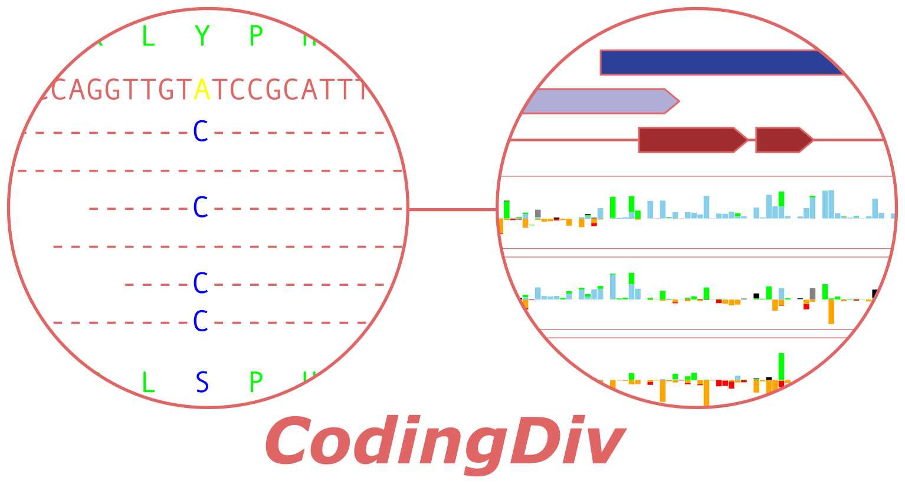
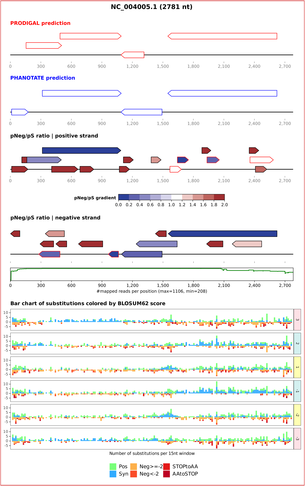
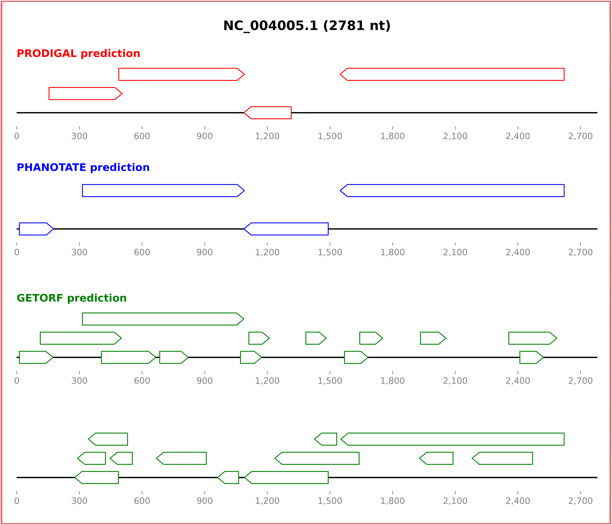

 <p align="center">
  
</p>

The goal is to explore **metagenome microdiversity** to better find protein coding genes. To this end (meta)genomes are mapped to any genome of interest to assess the selective constraints on each Open Reading Frame and *in fine* calculate the **pNeg/pS ratio**, dividing the number of negative scoring amino-acid substitutions (BLOSUM62) by the number of synonymous ones.<br>
**Overprinted and/or overlapping genes** will also be scanned here thanks to an initial raw ORF prediction on each reading frame, making this framework suitable for viral genomes known to overprint their genes to maximize their coding potential.

## Usage with docker container
You need to have installed the <a href="https://docs.docker.com/get-docker/">docker app</a> and at least **3 gigabytes** of free space: 

Once your docker is running, clone the repository and move into the `codingdiv` directory, then run:

```diff
docker build --tag codingdiv .
```

This will take around 20 minutes the first time but will be cached if you need to rebuild it in case of an update.

Instead of building the image from the `Dockerfile` you can also download the latest built version of the image like this:

```diff
docker pull erolondela/codingdiv
```

This command will download approximately 2.5 gigabytes, make sure to have enough free disk space.

You have now built your docker image named `codingdiv`.

In the cloned repository you have an example dataset with a reference genome in the `tylcv.fna` file (Tomato Yellow Leaf Curl Virus, GenBank accession #NC004005) and 1,106 genomes exhibiting at least 90% nucleotide identity with the reference in the `blast_hits_90.fna`. 

To work with this example data, you can start by creating a custom directory on your OS, here we created a `test` directory in our home repertoire:

```bash
mkdir $HOME/test/
```

Then copy the two example files into this new directory:

```bash
cp tylcv.fna $HOME/test/
cp blast_hits_90.fna $HOME/test/
```
You a re now ready to go ! 

**Note that your working directory can be an existing one, or even the one you just cloned, it just needs to contain the data files.**

To launch **codingDiv** on the example run the following command:

```diff
docker run -v $HOME/test:/data codingdiv codingDiv.sh tylcv.fna blast_hits_90.fna 90 1 2 1 3 N
```

The `-v` flag tells the docker that you are working in your custom directory, which is mirrored inside the container in a directory named `/data`. This allows docker to read and write files in your custom directory on your OS. Thus you should replace `$HOME/test` with the path to your own directory.

Then you are calling the `codingdiv` image, that you just built a few minutes ago with the `docker build` command, and finally comes the actual **codingDiv** script with all the positional arguments.

That's it ! Now you can replace the input files with your own reference genome alongside your own similar genomes/contigs or metagenomic reads.<br>
Note that you can input several metagenomes at once with a glob, but remember to escape the glob character with a back slash and double quotation marks. For example:

```diff
docker run -v $HOME/test:/data codingdiv codingDiv.sh tylcv.fna "\*_reads.fastq.gz" 90 1 2 1 3 N
```

If you wish to compare several reference genomes at once, we recommend separately running comparisons, with one genome per fasta file, as BWA treats multifasta as a single genome with several chromosomes, thus a read will only be aligned once across all chromosomes. Note that codingDiv can be parallelized on several processors, but keep in mind that BWA is itself parallelized and will use as many CPUs as indicated by the command line. As the mapping step with BWA is the most computationally expensive, we recommend running jobs one after another to maximize the number of CPUs available for BWA, especially if you have a large set of metagenome reads/contigs to map.

We now invite you to check out the **Output & errors** section as well as **Example SVG** for more information.

**Important:**

If you use the commands above the results will be produced by the `root` user, which is not a problem if you are in the superusers list of your machine, but if you are running coodingDiv in any remote server or HPC cluster you might not have the root rights. Using the `-u` flag you can get around this by telling docker that the user ID is the same inside and outside the container:

```diff
docker run -u $(id -u ${USER}):$(id -g ${USER}) -v $HOME/test:/data erolondela/codingdiv codingDiv.sh tylcv.fna blast_hits_90.fna 90 1 2 1 3 N
```

## Usage with Singularity container
If you are using <a href="https://docs.sylabs.io/guides/3.5/user-guide/quick_start.html">Singularity container</a> you can use **codingDiv** as follows:

First create your local image of **codingDiv**:

```diff
singularity build codingdiv.sif docker://erolondela/codingdiv
```

Then, after cloning the repository, move into your working directory containing the input files and run the example:

```diff
singularity run --bind $HOME/codingDiv:/data  codingdiv.sif  codingDiv.sh tylcv.fna blast_hits_90.fna 90 1 2 1 3 N
```

Here the repository was cloned in `$HOME`. 

Check out the **Output & errors** section as well as **Example SVG** for more information.

## Positional arguments

**codingDiv.sh tylcv.fna blast_hits_90.fna 90 1 2 1 3 N**

This is the command launched inside the container on our example dataset, the five numbers and the final letter are positional arguments for which you will get the detailed explanation if you run the script with no options:

```diff
docker run -v $HOME/test:/data codingdiv codingDiv.sh 
```

There are 8 arguments read by codingDiv:

1- Reference genome / Studied genome (FASTA)

2- Reads or contigs to map (FASTA or FASTQ)

3- Minimal ORF size (in nucleotides) [integer]

4- Translation table number used by EMBOSS getorf - https://www.ncbi.nlm.nih.gov/Taxonomy/Utils/wprintgc.cgi [integer 1-23]

5- Minimal number of reads required to evaluate an SNP [integer]

6- Minimal % of total mapped reads required to evaluate an SNP [double]

7- Number of CPU allowed for mapping [integer]

8- Force SVG for a very large genome, over 100 kilobases [Y|N]

This last option is not recomended as it will generate a very large SVG file.<br>
A better option would be splitting your genomes in several regions of 100Kb.

## Output & errors

If you want to jump to the results just open the `final_results` directory, but if you are interested in the intermediate files, four different directories will be created:

`final_results` will contain an SVG plot summarizing protein prediction and mapping results on genomic maps, and two TSV files which will contain the plotted information as a tab-separated table, one summarizing at the ORF level and the last one detailing the SNPs at each position of these ORFs.

`output_files` will have all the intermediate files used to generate the SVG plot and the final tables. 

`mapping_results` stores all the mapping files produced by the **BWA** aligner.

`prot_prediction` keeps track of protein and ORF prediction saving all the fasta files. 

If any error happens, execution will be halted and the error message will be written in the `stdout.txt` file, please create an issue if you notice a problem !

**Please note that if your genome is larger than 100Kb and you are using contigs around the same length to map them BWA will fail at the mapping step, generating an error. In that case consider splitting your contigs into read like sequences. You can easily do it with tools such as the `randomreads.sh` script from the <a href="https://github.com/BioInfoTools/BBMap">BBMap</a> suite.**

## Example SVG

This is the SVG plot you should expect, here is the example run on TYLCV:

<p align="center">
 
</p>

## What if no SNPs are found ? 

In that case `codingDiv` will halt execution and tell you that no variants were found.<br>
If you are still interested in comparing protein prediction to ORF prediction in a visual manner, you can launch `codingDiv` with the `-g` or `--getorf_only` tag. Only four positional arguments are needed: 

-g, --getorf_only<br>
    Produce only SVG plot of protein predictions, useful when no microdiversity data available

Positional arguments:<br>
1- Reference genome / Studied genome (FASTA)

2- Minimal ORF size (in nucleotides) [integer]

3- Translation table number used by EMBOSS getorf - https://www.ncbi.nlm.nih.gov/Taxonomy/Utils/wprintgc.cgi [integer 1-23]

4- Force SVG for a very large genome, over 100 kilobases [Y|N]

For example, if we only wanted the protein and ORF predictions of TYLCV: 

```diff
docker run -v $HOME/test:/data codingdiv codingDiv.sh --getorf_only tylcv.fna 90 1 N
```

All output files will be written in the current directory, and the SVG file named `tylcv_predictions.svg` should look like this:

<p align="center">
 
</p>

## Citation

For a detailed description of the pipeline, and to cite us:

**CodingDiv : visualize SNP-level microdiversity to discriminate between coding and noncoding regions.**<br>
Eric Olo Ndela & François Enault (2023, unpublished).

Laboratoire Microorganismes Genome & Environnement (LMGE)<br>
Clermont-Auvergne University (UCA)

<p align="center">
  
</p>

